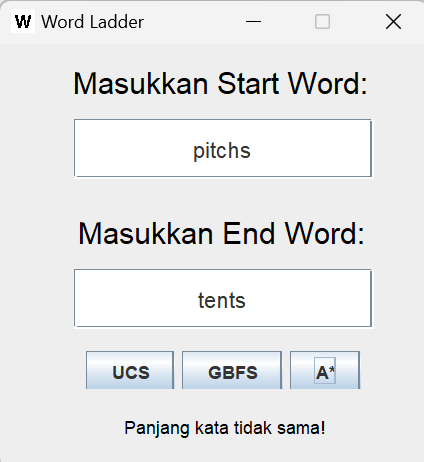
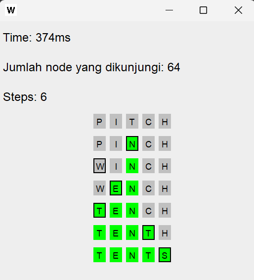

# Word Ladder Solver using Uniform Cost Search, Greedy Best First Search, A*

## Table of Contents
* [General Info](#general-information)
* [Dependencies](#dependencies)
* [Features](#features)
* [Screenshots](#screenshots)
* [Setup](#setup)
* [Cara Penggunaan](#cara-penggunaan)
* [Credits](#credits)

## General Information
Word Ladder adalah suatu sebuah permainan kata yang ditemukan oleh Lewis Carroll pada tahun 1877. Pemain diberikan dua kata dengan panjang sama, start word dan end word, dan pemain harus menemukan rantai kata yang menghubungkan antara start word dan end word. Penghubungan start word dan end word dilakukan dengan mengubah 1 karakter dalam kata secara tahap per tahap sampai kata sama dengan end word. Permainan ini dapat diselesaikan menggunakan konsep Route Planning. Route Planning adalah salah satu permasalahan programming di mana algoritma harus dapat mencari rute dari simpul awal menuju simpul akhir. Dalam permainan Word Ladder, simpul awal adalah start word, simpul akhir adalah end word, dan tetangga dari setiap simpul adalah kata yang berbeda 1 huruf dengan simpul tersebut. Algoritma Route Planning yang digunakan ada 3, yaitu Uniform Cost Search, Greedy Best First Search, dan A* Algorithm. Pada proyek ini, diperlihatkan perbedaan ketiga algoritma tersebut dalam menyelesaikan permainan Word Ladder.

## Dependencies
- Java - JDK 11 or above
- Java Swing

## Features
- Word Ladder Solver
  - Uniform Cost Search
  - Greedy Best First Search
  - A* Algorithm
- CLI/GUI

## Screenshots



## Setup
### Note
1. Pastikan daftar kata/word list terdapat dalam folder ./test/ dengan path berikut ./test/wordList.txt
2. Pastikan program dijalankan dari directory utama (./Tucil_13522002)

### Opsi 1. Run menggunakan JAR files
1. Open command line/terminal dari directory utama
   ```
   cd Tucil_13522002
   ```
2. Jalankan command berikut <br>
   Untuk CLI 
   ```
   java -jar ./bin/WordLadderCLI.jar
   ```
   Untuk GUI
   ```
   java -jar ./bin/WordLadderGUI.jar
   ```

### Opsi 2. Build dan Run dari awal
1. Open command line/terminal dari directory utama
   ```
   cd Tucil_13522002
   ```
2. Build java files
   ```
   javac -d ./bin/ ./src/*.java
   ```
3. Jalankan command berikut <br>
   Untuk CLI
   ```
   java -cp ./bin/ WordLadderCLI
   ```
   Untuk GUI
   ```
   java -cp ./bin/ WordLadderGUI
   ```

## Cara Penggunaan
### 1. CLI
1. Run program CLI
2. Masukkan input start word
3. Masukkan input end word
4. Masukkan pilihan algoritma
5. Program akan menampilkan solusi <br>
Pastikan start word dan end word benar (panjang sama dan ada di dalam word list) dan pilihan algoritma benar.

### 2. GUI
1. Run program GUI
2. Masukkan input start word pada Entry/Text Input Field yang tersedia
3. Masukkan input end word pada Entry/Text Input Field yang tersedia
4. Tekan salah satu tombol UCS/GBFS/A* untuk menjalankan algoritma sesuai pilihan
5. Program akan menampilkan solusi

## Credits
- Ariel Herfrison (13522002)
